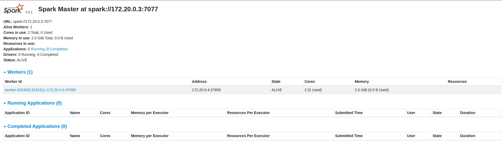
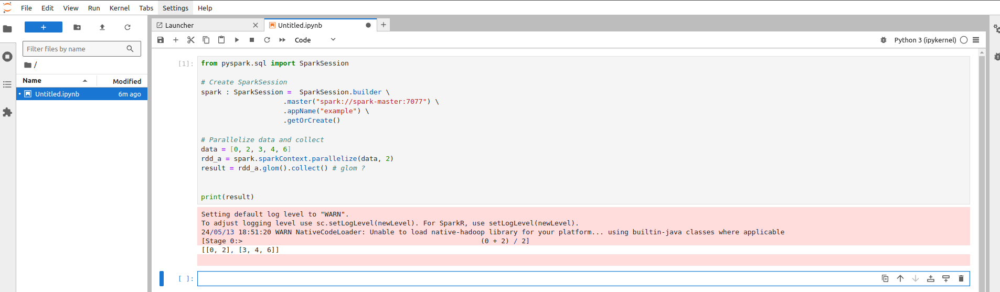

# Easy way setting up apache spark master, workers and jupyterlab with docker-compose

## Introduction

If you got here you are already interested in spark/pyspark and jupyterlab and you know about the power and scallability it provides, but you want to test it in your own environment without need to use any cloud provider. This article will show how to do it.

### Prerequisites

- [Installed docker](https://docs.docker.com/engine/install/)
- [installed docker-compose](https://docs.docker.com/compose/install/)

### What you will learn:
- seeting up master and worker container
- setup a jupyterlab compatible environment with spark
- how to use spark session using distributed jobs

## Setting up

### Setting up spark master

create in the project ./conf/spark-defaults.conf, to setup the spark master url and logs. This is the general configuration for the spark


```
spark.master                           spark://spark-master:7077
spark.eventLog.enabled                 true
spark.eventLog.dir                     /opt/spark/spark-events
spark.history.fs. logDirectory          /opt/spark/spark-events
```
`spark.master` is the url dns for the master node that we need to point out to use the spark infrastructure and other arguments are for events logs.

`docker-compose.yaml` block for the master:
```
version: '3.7'

services:

  spark-master:
    image: bitnami/spark:3.5.1
    command: bin/spark-class org.apache.spark.deploy.master.Master
    ports:
      - 8080:8080
      - 7077:7077
    volumes:
      - ./conf/spark-defaults.conf:/opt/bitnami/spark/conf/spark-defaults.conf

volumes:
  spark-logs:
```

### Setting up worker

`docker-compose.yaml` block, for the worker:
```
  spark-worker:
    image: bitnami/spark:3.5.1
    command: bin/spark-class org.apache.spark.deploy.worker.Worker spark://spark-master:7077
    depends_on:
      - spark-master
    environment:
      SPARK_MODE: worker
      SPARK_WORKER_CORES: 2
      SPARK_WORKER_MEMORY: 2g
      SPARK_MASTER_URL: spark://spark-master:7077
    volumes:
      - ./conf/spark-defaults.conf:/opt/bitnami/spark/conf/spark-defaults.conf

```

The worker will connect to the master to get the messages to do the jobs.

### Setting up jupyterlab

create the shared data for jupyterlab where the notebooks or data that you want to work will rest

```
mkdir app/
```

allow read and write privileges in order to allow jupyterlab to create and read the files:

```
chmod -R 777 app/
```
Create the `requirements.txt`
```
jupyterlab==4.2.0
```
It will be used to install the jupyterlab in the expecial container for the jupyterlab
Create the `dockerfile` based on the same image that runs spark in order to not have version conflicts between spark version and java versions setted up at the master and worker, it avoids incompatibilities. 
follows the dockerfile:

dockerfile
```
FROM bitnami/spark:3.5.1 as jupyter-local

COPY requirements.txt requirements.txt

RUN pip install -r requirements.txt

WORKDIR /app

EXPOSE 8888
```

`docker-compose.yaml` block
```
  jupyter-local:
    build: .
    command: python -m jupyterlab --ip "0.0.0.0" --no-browser --NotebookApp.token=''
    ports:
      - 8888:8888
    volumes:
      - ./app:/app # persistent storage
    environment:
      - JUPYTER_ENABLE_LAB=yes
```

### docker-compose all together

summarizing the `docker-compose.yaml`:

```
version: '3.7'

services:

  spark-master:
    image: bitnami/spark:3.5.1
    command: bin/spark-class org.apache.spark.deploy.master.Master
    ports:
      - 8080:8080
      - 7077:7077
    volumes:
      - ./conf/spark-defaults.conf:/opt/bitnami/spark/conf/spark-defaults.conf

  spark-worker:
    image: bitnami/spark:3.5.1
    command: bin/spark-class org.apache.spark.deploy.worker.Worker spark://spark-master:7077
    depends_on:
      - spark-master
    environment:
      SPARK_MODE: worker
      SPARK_WORKER_CORES: 2
      SPARK_WORKER_MEMORY: 2g
      SPARK_MASTER_URL: spark://spark-master:7077
    volumes:
      - ./conf/spark-defaults.conf:/opt/bitnami/spark/conf/spark-defaults.conf

  jupyter-local:
    build: .
    command: python -m jupyterlab --ip "0.0.0.0" --no-browser --NotebookApp.token=''
    ports:
      - 8888:8888
    volumes:
      - ./app:/app # persistent storage
    environment:
      - JUPYTER_ENABLE_LAB=yes

volumes:
  spark-logs:
```
for one worker run the all stack with the command:

```
docker-compose up
```

for more than one worker run this:

```
docker-compose up --scale spark-worker=3
```

### Up and runnig - lets use the jupyter lab

Open the browser at http://localhost:8080/ you should see the spark master UI



open the browser at http://localhost:8888 you should see the jupyterlab UI.
Create a new environment and test the conection with the example code:

```
from pyspark.sql import SparkSession

# Create SparkSession
spark : SparkSession =  SparkSession.builder \
                    .master("spark://spark-master:7077") \
                    .appName("example") \
                    .getOrCreate()

# Parallelize data and collect
data = [0, 2, 3, 4, 6]
rdd_a = spark.sparkContext.parallelize(data, 2)
result = rdd_a.glom().collect() # glom ?


print(result)
```

The result should be something like this:




to shutdown everything:

```
docker-compose down
```

Code at the repository: https://github.com/LeonardoLeano333/pyspark_example

## Conclusions:

Now you are ready to go to experiment the power of RDD in a distributed way locally.


## References:

https://hub.docker.com/r/bitnami/spark


https://medium.com/@MarinAgli1/setting-up-a-spark-standalone-cluster-on-docker-in-layman-terms-8cbdc9fdd14b

https://medium.com/@SaphE/testing-apache-spark-locally-docker-compose-and-kubernetes-deployment-94d35a54f222

